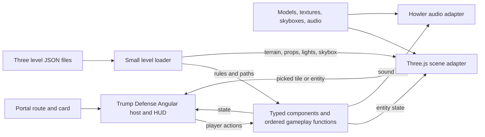

# Issue #62: TD2016 web rewrite plan

## Status and scope

- [x] Review the supplied rewrite draft, issue #62, the current fuzzy-waddle layout, and `/home/jernej/Git/School/TD2016/TrumpDefense2016`.
- [x] Implement the web game locally and verify the three-level campaign; details and remaining release conditions are recorded below.

**Issue lane:** Issue #62 has the `new feature` label, outside the repository's `agent-ready` lane. The user approved focused verification after implementation. No commit, push, or PR is implied by this plan. The newer request expands the issue's earlier asset-gathering scope into an Angular + Three.js game. An in-game map editor is deferred.

**Goal:** Recreate TD2016 as a playable browser game in fuzzy-waddle. Keep its game code and level content grouped under the `trump-defense` feature, apart from the portal's route/card and static asset hosting. Use composition through game components and systems rather than C++-style gameplay inheritance. Preserve its three level experiences and source commentary. Store each level as data with clear gameplay and scene boundaries, so a future editor can read and change that data without a renderer rewrite.

## Findings that change the supplied draft

1. TD2016 has **one shared physical grid and map layout**: `Grid.cpp` defines a 128 × 96 world, 8-unit tiles (16 × 12), one ground path and one flying path; `Draw.cpp` uses one `Map` mesh and the same scenery placement. The three levels vary by enemies, difficulty, music, lighting, and skybox. Create **three separate level definitions** that reproduce those historical differences. Do not invent three different historical maps.
2. The C++ source has **no working in-game map editor or serialized level files**. The editor in the draft was a new feature and is now deferred. Define level content as data rather than embedding it in gameplay or renderer switches, but do not build editor UI or import/export workflows now.
3. Lighting is more specific than a preset: `Resources.cpp` constructs a directional light, point lights, and green/red spotlights at the route ends; `Draw.cpp` places path point lights at path indices divisible by five. Level 2 changes the ambient/directional setup and uses `CubeMapNight`; levels 1 and 3 use the regular cubemap. Capture light type, transform, color, intensity/attenuation equivalent, and cone as level scene data.
4. The draft's gameplay table is an **initial reading, not a verified specification**. For example, level 2 lowers tower range, level 3 randomizes tower placement, and level rosters accumulate through `Game::nextLevel`. The source also contains quirks (such as repeated ground waypoints and a time guard on wall building) that need an explicit parity decision, rather than accidental translation.
5. The plan should distinguish asset reuse, conversion, replacement, and attribution. `.obj` to `.glb` may be useful, but is not a prerequisite for every object or proof that textures/materials will survive unchanged. Inspect the source models, textures, cubemaps, audio rights, dimensions, orientation, UVs, and browser performance first.
6. The supplied class-by-class file tree and TypeScript interfaces are provisional. They omit scene objects/lights and imply some unverified values. Keep contracts small and derive them from a source-to-feature inventory before freezing names or shapes.
7. `Resources` creates each run with 200 money, 10 lives, and zero wall height; `main.cpp` starts another run after a victory while `Game::nextLevel` grows the enemy roster. Define what resets and what carries forward at each transition, and test it explicitly.
8. Existing game libraries own assets inside their feature directories and the portal build copies them. Keep Trump Defense assets and level files inside `libs/games/trump-defense/`, with portal build configuration as the serving boundary.
9. This is a **rewrite of game behavior and content**, not a C++ class-by-class port. The old SDL loop, OpenGL/GLSL pipeline, resource loaders, and input plumbing are platform code to discard, not systems to reproduce in TypeScript.

## Non-negotiable implementation rules

- **TypeScript length:** Every authored `.ts` file, including tests, should contain at most **300 lines of code**. Blank lines and comment-only lines do not count; a line containing both code and a comment counts as code. Split modules by responsibility instead of compressing code or removing documentation. Add a repository check for the limit and document how it counts lines.
- **Comment preservation:** Inventory relevant comments and documentation in TD2016 and in any fuzzy-waddle code touched by the rewrite. Retain existing comments alongside equivalent behavior or documentation in the new codebase, preserving their meaning and source attribution; translate only when needed for clarity and retain the original where the wording itself matters. Do not silently drop comments when splitting code. If a comment describes abandoned/disabled behavior, record it in migration notes with its source location and disposition rather than presenting it as active behavior. Review the comment inventory at each stage and at closure.
- **Composition over inheritance:** Model runtime towers, enemies, projectiles, and other changing actors as entities with small typed data components; systems implement movement, spawning, targeting, combat, economy, and progression. Do not recreate the C++ `GameObject` class as a monolithic base or introduce tower/enemy subclasses. Keep this ECS scoped to Trump Defense rather than adding a monorepo-wide framework. Angular UI components are separate from gameplay components.
- **Use platform capabilities:** Write TypeScript for the game-specific rules, state, level loading, and small integration adapters. Use browser `requestAnimationFrame` for scheduling, Three.js for scene rendering/materials/lights/OBJ loading/raycasting, Angular for UI and input binding, and Howler for audio. Do not recreate SDL, the OpenGL wrappers, the OBJ loader, or the legacy GLSL shaders. Custom shaders are out of scope unless a specific visual requirement later proves necessary.
- **Level authority:** Each shipped level must load from a validated, versioned level definition. Level-owned scene details and gameplay settings belong in that definition, not in renderer switches or scattered level-number checks. Keep the format serializable so an editor can be added later.
- **Per-level independence:** Each level can select its own terrain/map mesh, skybox, static object instances and transforms, lights, paths, audio, enemies, economy, and rules. The original three levels may reference shared assets or reusable content, but one level's scene must be changeable without changing the others.
- **Map fidelity:** Reproduce the original shared map geometry, buildable tiles, ground/flying paths, route endpoints, wall and scaffolding area, buildings/cacti/tutorial props, skyboxes, and per-level lights as closely as the source assets allow. Preserve authored transforms and visibility. Document any approved difference.
- **Source traceability:** Keep a concise mapping from each ported mechanic/scene element to its C++ file and line or asset path, plus any intentional behavior change.

## Smallest practical implementation

- Add only **Three.js and its TypeScript types**. Angular, Howler, Jest, Ajv, and Nx are already in the workspace. Three's OBJ loader is a bundled addon, not another package. Keep Ajv in development tooling: validate the three trusted, shipped JSON files in Jest/build checks; the production loader needs only file-load/error handling and a small version check. Add runtime schema validation only if user-supplied levels or an editor become real features.
- Keep the two planned feature libraries, but do not add another engine, ECS package, physics package, state store, event bus, input framework, or backend. Gameplay can be plain typed records/maps and a few ordered update functions. Angular HUD and canvas pointer/keyboard handlers turn input into typed actions; a small coordinator advances gameplay and tells the renderer/audio adapter what changed. No generalized plugin architecture or command framework is needed.
- Use three complete, independently editable level JSON files, even when values repeat. They may point at the same historical map/model/skybox assets. Use relative asset paths resolved against one feature asset base URL, with a test that referenced files exist; add a manifest/registry only if the real asset inventory shows a need. Avoid a merge/inheritance scheme for level defaults that would make a later editor interpret multiple files.
- Use Three's scene, materials, lights, raycaster, and bundled OBJ loader directly. Add camera controls only if the chosen camera interaction requires them. Convert or replace only assets that need it; do not build a generic conversion pipeline, scene diff engine, custom shader system, or object pool in advance. A simple scene rebuild on a level change is enough unless profiling shows otherwise.
- Keep one small fixed-step accumulator for gameplay timing, called from the browser animation callback; render once per frame. No game-loop library or duplicate timing system. Begin with no save system or custom debug/performance framework; add them only for a confirmed requirement. Measure bundle size and play performance before adding compression, LOD, physics, or optimizer dependencies.

## Architecture and level contract

- Keep this as one **Trump Defense feature** with two focused Nx libraries: engine-independent entities, typed components, ordered systems, and the level type in `libs/games/trump-defense/gameplay`; Angular host/HUD and small Three.js/audio adapters in `libs/games/trump-defense/interface`. Keep the three level files, models, textures, skyboxes, and sounds under `libs/games/trump-defense/interface/src/assets/trump-defense/`; configure the portal build to copy them to `/assets/trump-defense/`. The portal route/card, aliases, asset-copy entry, and game-card image are the small integration points outside the game libraries. No backend is required for local single-player play.
- Schedule one browser animation callback that advances a fixed-step simulation clock and renders the latest state; do not port the SDL event/game loop. Keep an explicit system order and typed player actions. Inject or seed random choices so level 3's random builds can be reproduced in tests. Systems update component data; the Three.js adapter reads entity state and scene definitions and owns picking, camera, and GPU/asset lifecycle. A small Howler adapter handles sound. The renderer must not decide combat or progression. Pause/resume and level transitions must not depend on frame rate.
- Use stable entity IDs and only the components actually needed, such as transform, health, path follower, weapon/targeting, and occupancy. Prefer direct typed lookup and ordered functions to class inheritance or a generic ECS framework. Level loading creates initial entities and state; runtime changes stay separate from immutable level data.
- Keep a shared `LevelDefinition` type and three distinct, declarative level files (for example, `level-1.json`, `level-2.json`, `level-3.json`). Each file provides its own gameplay and scene configuration and may reuse asset paths, without requiring the levels to share a map in future. One small loader reads the selected file and passes gameplay fields to the simulation and visual fields to the renderer. Jest/Ajv validates shipped files before release.
- The versioned definition must describe: grid and coordinate convention; buildable/blocked/path cells; ordered ground and flying waypoints; terrain/map asset path and transform; static prop instances with asset paths and transforms; directional, point, and spot lights; skybox/background; wall/scaffold/endpoint configuration; wave/roster/spawn/scaling rules; starting money/lives and victory rules; music/SFX references. Separate immutable level content from runtime occupancy and transient effects.
- Validate level IDs, asset paths, bounds, path continuity, buildability, and light settings in the shipped-level checks. The renderer consumes the selected level's scene data, so a later editor can change terrain, skybox, props, or lights by changing level data instead of Three.js code.
- Define a transition contract: on level completion, stop the old simulation, remove its entities, dispose or reuse Three.js resources deliberately, load the next level, and initialize money/lives/wall height/timers from its definition. Preserve cumulative enemy-roster behavior only where specified by the new level data; defeat, retry, and final victory each have an explicit state transition.
- Use the workspace's existing **Howler** for music/SFX, **Ajv** for shipped-level checks, and **Jest** for gameplay, level, and UI tests. Add Three.js and its TypeScript typings for rendering; use its bundled OBJ loader addon. Consider camera controls or an offline model optimizer only if the camera design or asset audit requires them. Avoid a separate ECS or physics dependency unless a concrete requirement appears.
- Preserve world-space placement: define C++ to Three.js coordinate mapping once (including the source's negative Z render convention), mesh pivots/scales, tile origins, and camera orientation. Gameplay range/path/build rules use the same tile-to-world mapping as Three.js picking, without depending on mesh geometry. Validate with a source comparison scene for each level.
- Keep the portal's initial bundle small through lazy route loading. Show actionable loading failures, handle unavailable WebGL without a blank page, release listeners/audio/GPU resources on route exit and level change, and verify asset paths in the production build and service-worker cache.
- Defer editor route, UI, editing controls, save/import/export, and custom-level support. The level format and loader are the only editor-enabling work in this scope.

## Delivery stages

### 1. Source and asset audit

- [ ] Inventory relevant C++ behavior, source comments, models, textures, cubemaps, sounds, and ownership/attribution. Record exact default values and level-specific overrides, including cumulative enemy rosters and level 3 random building.
- [x] Capture reference images/video or reproducible screenshots for all three levels if the original can run; otherwise use source geometry/assets and clearly label visual approximations.
- [x] Decide each legacy quirk: preserve it, fix it with a documented reason, or defer it. Treat the attached draft's numbers as hypotheses until checked.
- [ ] Confirm which assets can be reused or converted and which need replacement. Record licenses/attribution and expected download/performance cost.
- [x] Record initial state, reset/retention behavior, level transitions, defeat/retry, and final victory from the source, including the cumulative enemy roster.

### 2. Level format and faithful shipped levels

- [x] Define the small versioned level shape and world-coordinate mapping; validate shipped data in development checks.
- [x] Author three separately loadable level definitions from the shared TD2016 layout and per-level variants. Each must have independently selectable **terrain/map, skybox, props, lights, paths, and gameplay rules**, even where the shipped values currently match.
- [x] Add Ajv JSON Schema validation plus semantic checks that schemas cannot prove: connected ordered paths, valid endpoints/buildable tiles, existing asset paths, and coherent per-level rules. Compare grid dimensions, ordered waypoints, route endpoints, object transforms, light counts/positions, skyboxes, rosters, and settings with the source inventory. Test that changing one level's scene configuration does not alter another level, and that loading a level creates the expected component state.

### 3. Playable core and renderer

- [x] Build typed entity components and ordered, deterministic systems with tests for movement, tower targeting, damage/rewards, purchase/upgrade, wall victory, defeat, progression, pause/resume, and level-specific rules. Compose tower and enemy variants from definitions/components rather than subclasses.
- [x] Add a small Three.js scene/camera/picking/asset adapter; render the selected level's terrain/map, lights, props, skybox, and runtime entities/effects from its level definition and component state. Match source look within documented asset and browser limits.
- [x] Add Angular HUD, controls, sound, loading/error states, and cleanup on route changes. Integrate the portal route and game card.
- [x] Keep HUD controls usable with keyboard and pointer input, resize the canvas without breaking picking or obscuring the playfield, and provide visible feedback for unaffordable/invalid actions.
- [x] Use the repository's Jest/Nx setup for gameplay system and integration tests, Ajv-backed tests for all three shipped JSON files, and tests for every new Angular component and service. Cover invalid level data, spawn/movement/combat timing, level reset/carryover, final victory, scene replacement, and listener/resource cleanup; mock WebGL where appropriate and use browser playtests for visual behavior.

### 4. Verification and closure

- [x] Enforce the 300-code-line TypeScript limit; review module boundaries, comment migration, and source traceability.
- [x] Review the gameplay model for unintended inheritance, duplicate game rules in the renderer, unclear component ownership, and missing system-order tests.
- [x] Confirm no legacy SDL/OpenGL/GLSL/OBJ-loader analogue was built where browser or Three.js functionality already covers the need.
- [x] Run focused format, lint, type, tests, asset validation, and production build checks according to the repo workflow and the issue's eventual lane.
- [x] Play through levels 1–3 and compare map composition, lighting, progression, audio, and core mechanics against source/reference evidence. Exercise level loading, invalid definitions, per-level scene variation, defeat/retry, and level changes. Record approved deviations.
- [ ] Check lazy loading, production asset URLs, initial download size, frame rate with typical tower/enemy counts, WebGL failure handling, and GPU/audio/listener cleanup after repeated level and route changes.
- [x] Perform the repository's Omission Audit and separate Final Closure Audit before calling implementation complete.

## Implementation acceptance

- [x] The portal opens a playable level 1; all three levels complete in sequence, with explicit defeat/retry and a final victory after level 3.
- [x] Each shipped level loads from its own validated file and can independently change terrain, skybox, props, and lights without changes to gameplay systems or Three.js scene code.
- [x] Core TD2016 controls, economy, towers, enemies, paths, wall objective, audio, and level-specific behavior work or have a recorded approved deviation; all relevant legacy comments are retained or accounted for.
- [x] Jest behavior/UI tests, Ajv plus semantic level checks, visual playtests, the TypeScript length check, and the applicable repository build/lint/type checks pass before delivery.

## Implementation record (2026-09-30)

- The user authorized the expanded rewrite. The portal now lazy-loads an Angular/Three.js game at `/trump-defense`; the feature's `gameplay` and `interface` libraries own all game code and three independent JSON level files. No editor was added.
- Enemy movement lane, altitude, rewards, tower targeting, damage, range, audio cue, and upgrade behavior are authored in each level and copied into entity components. Systems consult those components. Visual names identify assets; they do not decide gameplay traits. This also applies to the former `MexicanBalooner`/`MexicanBaloon` flight check.
- The original shared grid, ground and flying paths, terrain, props, wall, day/night cubemaps, path point lights, endpoint spotlights, music, and custom SFX were migrated. `libs/games/trump-defense/README.md` maps source files and preserved comments to the new authority and records two deliberate visible changes: roster rotation and brief shot lines.
- Browser playtesting opened all three levels, bought a tower, paused and resumed, exercised camera controls at desktop and mobile sizes, completed all three levels, restarted the campaign, and exercised defeat/retry. Automated gameplay, Angular, level/asset, and portal tests passed. The production build, lint, TypeScript checks, format checks, and 300-code-line check passed with the repository's compile-only LFS setting. The Trump Defense route is lazy loaded; its chunk is about 583 kB raw and 123 kB estimated transfer. The asset directory is about 28 MiB on disk.
- A deterministic simulation using the shipped, unmodified level rules reached victory in all three levels through tower purchases and wall construction. The source's steep level-1 health growth remains: an early-wall strategy loses, so players need to invest in defenses first. The browser victory check accelerated the economy and wall timer to test transitions quickly; it was not a balance test.
- A 40-tower browser smoke run loaded all game assets without errors. Its headless software WebGL renderer measured about 7 frames per second, which is not a hardware performance result; desktop/mobile GPU performance remains to be measured on a target device.
- The original Windows SDL executable was not available for direct side-by-side capture, so source code and source assets are the visual reference. The TD2016 author identified Stronghold Crusader and Command & Conquer: Red Alert as sources of material in the original game. `libs/games/trump-defense/ASSET_CREDITS.md` and the in-game credits record this; the exact source and redistribution terms of each included audio recording remain undocumented. This worktree initially had 511 unrelated Git LFS pointer assets. After `pnpm assets:hydrate`, all 524 tracked audio files passed the normal asset check, and portal serve and production build passed without the compile-only bypass.

## Decisions made for this implementation

| Decision           | Outcome                                                                                                                                             |
| ------------------ | --------------------------------------------------------------------------------------------------------------------------------------------------- |
| Scope of issue #62 | The user's implementation request superseded the older asset-only issue wording.                                                                    |
| Theme and name     | Retained the TD2016 identity and source art for fidelity, pending release rights review.                                                            |
| Legacy quirks      | Kept repeated path waypoints and core visible rules; documented the spawn overwrite and projectile presentation changes in the feature README.      |
| Asset conversion   | Kept OBJ meshes through Three's bundled OBJ loader, converted textures to WebP, resized cubemap faces, and excluded the uncertain Crusader samples. |

## Deferred follow-up: optional map editor

An editor may later open and save the same level definitions and expose tile/path, terrain, prop, skybox, light, and rule controls. Its route, UI, import/export, custom levels, and playtest workflow are **not acceptance criteria for issue #62**. The only current requirement is that the three levels and renderer use data boundaries that make such an editor possible without restructuring gameplay or rendering.
