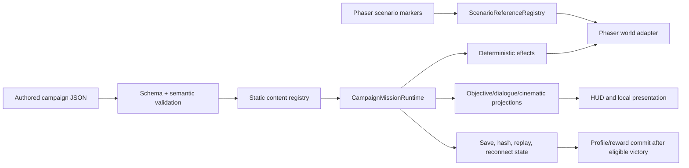
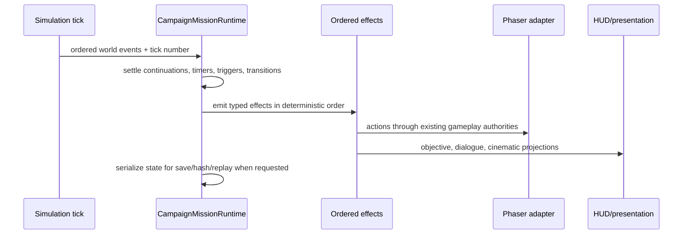

# AOTA Campaign Architecture (Probable Waffle)

This document is the long-term reference for the **Ashes of the Ancients (AOTA)**
campaign framework added by the campaign PR. It explains the ownership boundaries, deterministic lifecycle, authored-content model, and the work covered by campaign issues [#700](https://github.com/JernejHabjan/fuzzy-waddle/issues/700) through
[#716](https://github.com/JernejHabjan/fuzzy-waddle/issues/716).

It is written for maintainers and future LLM-assisted changes. Campaign source code and schemas remain authoritative; this page is the cross-layer map, not a second runtime specification.

---

## 1. Design model in one page

1. **Authored content model**: a campaign is versioned JSON content, schemas, and typed contracts—not scene-specific imperative scripts.
2. **Simulation model**: the pure campaign runtime consumes a stable ordered event stream and emits deterministic effects. Phaser adapts those effects to the world.
3. **Authority model**: content/registry owns definitions; the runtime owns mission state; Phaser owns scene integration; presentation projects state but never writes it; profile persistence owns durable rewards.
4. **Recovery model**: mission revision, runtime state, deterministic random state, encounters, objectives, continuations, and integrity state travel through saves, snapshots, reconnect, and replay.
5. **Delivery model**: all 20 story missions have schema-valid scaffolds; Dreams and Cyclops & Sheep are the initial playable vertical slices.



**Critical invariant:** local UI, camera, audio, and scene objects may display campaign state, but only the deterministic runtime changes mission progression.

---

## 2. Source-of-truth areas

| Responsibility                                                        | Owning area                                                                                                                                             |
|-----------------------------------------------------------------------|---------------------------------------------------------------------------------------------------------------------------------------------------------|
| Public campaign API, contracts, catalogue, runtime, validation        | [`libs/games/probable-waffle/campaign`](../libs/games/probable-waffle/campaign)                                                                         |
| Campaign protocol, game-state, snapshot and replay contracts          | [`libs/games/probable-waffle/protocol`](../libs/games/probable-waffle/protocol)                                                                         |
| Phaser launch, mission director, scenario markers, world effects, HUD | [`libs/games/probable-waffle/phaser/src/lib/campaign`](../libs/games/probable-waffle/phaser/src/lib/campaign)                                           |
| Campaign mission/profile UI and launch flow                           | [`libs/games/probable-waffle/interface/src/lib/gui/campaign`](../libs/games/probable-waffle/interface/src/lib/gui/campaign)                             |
| Profile/reward API authority                                          | [`libs/games/probable-waffle/server/src/lib/probable-waffle/campaign`](../libs/games/probable-waffle/server/src/lib/probable-waffle/campaign)           |
| Durable profile/reward/replay/save schema                             | [`supabase/schemas/0008_probable_waffle_campaign_profiles.sql`](../supabase/schemas/0008_probable_waffle_campaign_profiles.sql) and campaign migrations |

Do not create parallel campaign state in a scene, Angular component, or database adapter. Extend the owner above and project its state outward.

---

## 3. Authored content, schemas, and catalogue

Each mission has a directory under:

`libs/games/probable-waffle/campaign/src/lib/content/ashes-of-the-ancients/missions/`

It contains:

- `mission.json`: catalogue metadata, participants, phases, triggers, objectives, checkpoints, difficulty, scenario references, and implementation brief.
- `dialogue.json`: stable text/speaker/portrait/line/cinematic definitions.
- `rewards.json`: pending and durable reward definitions.

`MissionImplementationBrief` retains the code-owned mission design: phase plan, checkpoint candidates, planned scenario IDs, mechanics, co-op notes, dependencies, assets, test intent, definition of done, and remaining TODOs. It is deliberately separate from executable mission data.

### Content status

- `skeleton`: a schema-valid, documented mission scaffold. It is visible as planned content and cannot launch.
- `playable`: executable phases and validated runtime references may launch through the campaign path.
- `complete`: reserved for a fully shipped mission with remaining content work cleared.

The current catalogue contains 20 mission briefs: 18 `skeleton` missions plus the
`playable` Dreams and Cyclops & Sheep vertical slices. This is intentional; the PR does not claim all 20 missions are playable.

Schemas validate the broad JSON shape, while semantic validation rejects duplicate IDs, invalid references, content cycles, missing registry entries, invalid prerequisites, and invalid cross-bundle links with source paths.

---

## 4. Deterministic mission lifecycle

`CampaignMissionRuntime` is a framework-free statechart interpreter. It owns phase entry/exit, triggers, objectives, timers, encounters, action continuations, cinematic state, checkpoints, outcomes, diagnostics, and the per-tick work budget.



### Ordering rules

- The runtime uses simulation ticks, never wall-clock time, for gameplay-affecting timers and cooldowns.
- Events, actions, transitions, and effects have explicit stable ordering.
- A per-tick budget prevents an accidental action/transition loop from blocking the simulation.
- Completed phase-entry actions are recorded so save/load does not execute them again.
- Normal cinematic completion and skip must converge on the same finalized world and runtime state.

Skirmish and instant-game paths remain unchanged when campaign context is absent.

---

## 5. Scenario authoring and Phaser integration

Campaign content refers to stable authored IDs, not Phaser variable names, labels, or editor UUIDs. The `ScenarioReferenceRegistry` compiles Phaser Editor markers and actor components into typed indexes for:

- actors;
- points, regions, routes, groups, and spawn sets;
- camera shots;
- region occupancy and route/spawn lookup.

`CampaignMissionDirector` starts only for campaign launch context. It connects the runtime with the scenario registry, game-state save/hash boundary, Phaser world adapter, participant setup, objectives, cinematics, and mission outcome authority.

`CampaignPhaserWorldAdapter` is the controlled escape hatch into normal RTS systems. It issues gameplay operations such as movement, spawning, owner changes, damage, construction, resource grants, diplomacy, camera requests, and temporary world state through existing authorities rather than directly corrupting scene state.

### Planned marker follow-up

Dreams and Cyclops & Sheep have executable scenario references. The broader all-map planned-reference pass remains tracked separately: the intentional failing test in
`scenario-editor-validation.spec.ts` must become a passing test once every planned Phaser Editor marker is authored. Marker authoring does not make a skeleton mission launchable by itself.

---

## 6. Actions, conditions, triggers, objectives, and encounters

Mission definitions use typed discriminated unions and registries instead of a central scene-script switch:

- **Conditions** query deterministic mission facts or a narrow world adapter.
- **Triggers** define event policy, once/cooldown/edge behavior, participant policy, and actions.
- **Actions** support sequencing, parallel/race composition, waits, cancellation, continuation serialization, and phase-owned cleanup.
- **Objectives** model primary, secondary, optional, hidden, tutorial, survival, and failure goals with checklist/counter/reveal/complete/fail/impossible behavior.
- **Encounters** support scripted waves, full-AI participants, passive participants, alliances, difficulty/player-count resolution, and save-safe wave state.

Owner tokens ensure temporary modifiers, subscriptions, actor locks, timers, and presentation resources are cleaned up when their phase/action ends.

---

## 7. Dialogue, cinematics, tutorials, and HUD

Dialogue lines have stable IDs separate from text and optional audio assets. The presentation queue orders critical warnings, story dialogue, objectives, tutorials, and ambient content without allowing local presentation order to change gameplay.

Campaign cinematics support gameplay, directed, and paused modes. Their declarative timeline can drive dialogue, camera shots/actors, letterbox, audio, title, UI suppression, and actor animation; their final gameplay actions are deterministic and skip-safe. Seen cinematics may use the authored fast-skip policy.

The Phaser objective HUD and projection store reconstruct state from the runtime after save/load or scene restart, avoiding duplicate notifications. Semantic input prompts allow authored tutorials to describe an action rather than hardcoding one device key.

---

## 8. Progression, profile, saves, replay, and recovery

### Profile and rewards

An account has one versioned campaign profile. It stores completed missions, mastery, seen cinematics, loadouts, progression wallet, unlocks, upgrades, inventory, and idempotent reward claims.

Victory reward commits are transactional and idempotent:

```text
eligible deterministic victory
  -> integrity check
  -> resolve pending rewards against profile + mission allowance
  -> atomic profile revision + reward-claim ledger commit
  -> profile/UI refresh
```

Mission allowances restrict an early replay to its allowed content without mutating the account's later progression. Replay/invalid/developer-mutated runs cannot commit durable rewards.

### Save, replay, and reconnect state

Campaign saves extend the existing game-save path with mission ID/revision, campaign runtime schema version, run/checkpoint/profile/loadout context, participant snapshots, and integrity/replay metadata. Restore uses an ordered coordinator so runtime state, world state, objectives, encounters, continuations, and presentation recover without repeating completed entry actions or rewards.

Campaign deterministic state participates in stable hashing, replay context, snapshot correction, and reconnect restoration. Versioned mission migration chains reject unsupported saves safely rather than silently loading incompatible data.

---

## 9. Angular UI, server authority, and SQL

The campaign UI exposes mission availability, difficulty, loadout selection, replay, mastery, result/reward summary, and profile synchronization. It shares the campaign catalogue with Phaser rather than maintaining an independent mission list.

The NestJS campaign service and Supabase functions own authenticated profile reads, profile revisions, guest merge, reward-claim idempotency, and victory transaction commit. SQL comments document tables, columns, constraints, indexes, functions, and the profile/reward workflow so database behavior remains understandable with the code.

---

## 10. Co-op-safe contracts and developer tooling

Playable campaign co-op is not part of this delivery, but mission contracts are co-op-safe now: participant slots, ownership, resource policy, objective policy, failure policy, player-count difficulty, disconnect behavior, host coordination, save rebinding, and cinematic vote hooks avoid assuming one local player forever.

Developer tooling includes deterministic trace/diagnostic snapshots, lifecycle-safe commands, a Phaser developer panel, objective/dialogue/cinematic projections, semantic validators, scenario-map validation, and a pure mission test harness. Developer mutations invalidate reward eligibility instead of accidentally granting durable progression.

---

## 11. Issue coverage

| Area                                        | Issues addressed       |
|---------------------------------------------|------------------------|
| Campaign architecture and content contracts | #700, #701             |
| Statechart runtime and scenario binding     | #702, #703             |
| Actions, objectives, dialogue, encounters   | #704, #705, #706, #707 |
| Progression, saves, replay                  | #708, #709, #710       |
| Profile UI and co-op extension contracts    | #711, #712             |
| Tooling, mission scaffolds, vertical slices | #713, #714, #715, #716 |

---

## 12. Deferred or intentionally incomplete work

Issue [#717](https://github.com/JernejHabjan/fuzzy-waddle/issues/717) remains the deferred roadmap. It includes playable campaign co-op, a graphical logic editor, public data-only mods, advanced replay/archive tooling, and further campaign tooling.

The PR also intentionally leaves these content tasks outside the initial runtime framework:

- 18 mission definitions remain scaffolds, not playable gameplay paths.
- Final voice recordings and selected bespoke art remain content-production work for Dreams and Cyclops & Sheep.
- Planned Phaser Editor marker inventories for all maps still need to be authored and validated before the intentional planned-reference failure test can be removed.

---

## 13. Guardrails for future changes

1. Keep campaign gameplay state in the deterministic runtime/game-state authority; never use UI or Phaser presentation as a source of truth.
2. Add authored behavior through typed contracts, registries, and validators; do not add a central mission-ID switch or scene-specific orchestration branch.
3. Use stable scenario IDs and validate them against the target map before launch.
4. Make every waiting action, timer, subscription, lock, and temporary modifier owner-scoped and cleanup-safe.
5. Keep save/replay/hash/reconnect coverage synchronized whenever a deterministic campaign state family changes.
6. Use `satisfies ExactContract` for unannotated inline authored/configuration objects when an exact contract exists.
7. Do not grant rewards until an eligible deterministic victory reaches the idempotent profile transaction.
8. Keep scaffolds, planned references, placeholders, and deferred features visibly separate from executable/launchable campaign content.

---

## 14. Existing RTS systems that campaign content must extend

The campaign framework coordinates the existing RTS rather than rebuilding combat, economy, pathfinding, AI, persistence, or multiplayer under campaign-specific names. Mission authors and maintainers should start from the appropriate existing authority:

| Existing capability                                                                          | Campaign use                                                                                                                                       |
|----------------------------------------------------------------------------------------------|----------------------------------------------------------------------------------------------------------------------------------------------------|
| Two factions, tech trees, workers, resources, construction, production, research, population | Participant setup, mission allowances, tutorial pacing, scripted grants, and difficulty rules constrain or extend normal faction/tech authorities. |
| Melee/ranged/spell/AoE combat, healing, towers, ships, flying actors, status effects         | Encounters and world actions direct normal actors and combat systems; mission code must not duplicate damage or movement simulation.               |
| Ground/water/air terrain, navigation, collision, walls/stairs, boats, height-aware movement  | Scenario points, regions, routes, escorts, transports, hazards, and scripted movement are authored against real map/navigation rules.              |
| Isometric maps, water, environment actors, fog of war, minimap, day/night lighting           | Scenario markers and cinematic presentation bind mission flow to existing maps and local visual systems.                                           |
| HUD selection, action buttons, queues, resources, minimap, pause/end-game/reconnect dialogs  | Objective/tutorial/cinematic projections add campaign surfaces without becoming a second gameplay UI authority.                                    |
| Computer-player economy, tech, logistics, base planning, force maintenance, map analysis     | Campaign participants may use full AI, tactical/scripted encounter control, or a mixture of both.                                                  |
| Game saves, cloud synchronization, score/history, replay recording/playback                  | Campaign save metadata and runtime state extend these paths with mission revision, checkpoint, profile, replay, and integrity context.             |
| Lockstep multiplayer, lobby, matchmaking, spectators, chat, reconnect/pause                  | The first delivery is single-player playable, but participant and restore contracts remain compatible with future campaign co-op.                  |

This integration rule is deliberately conservative: a campaign-specific adapter may translate deterministic effects into an existing RTS service, but it must not bypass that service's ownership, validation, cleanup, or multiplayer semantics.
